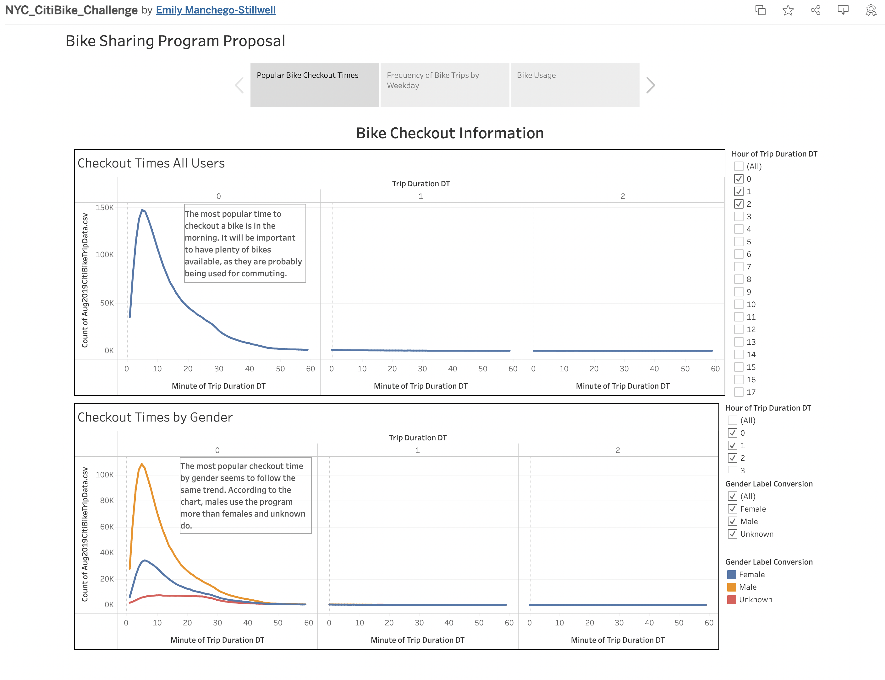
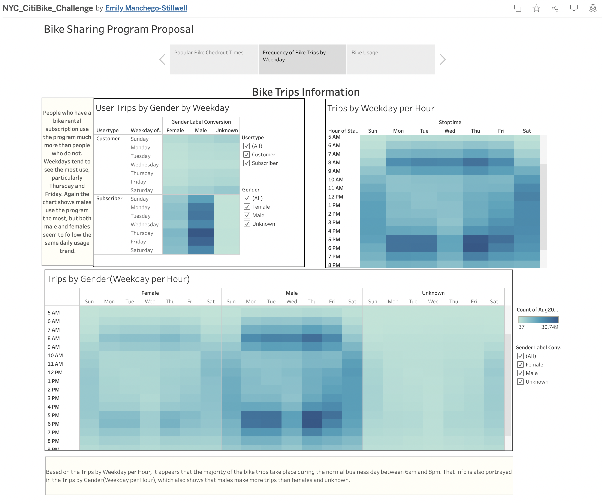
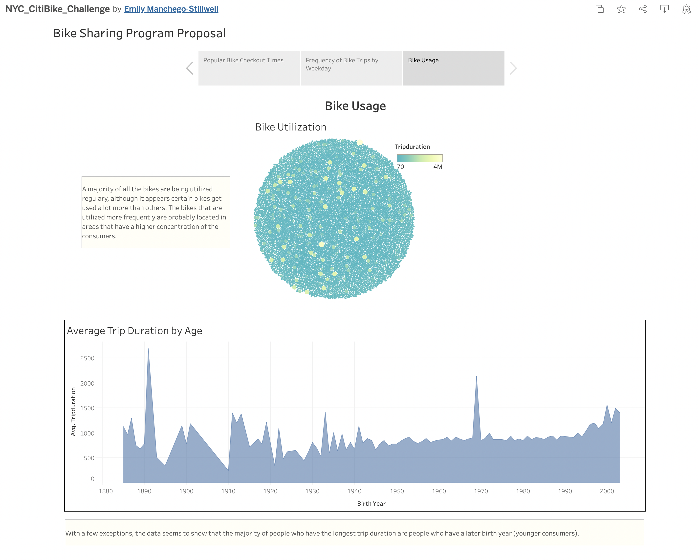

# Bike Sharing Proposal
## Overview:
The purpose of this analysis was to analyze a working bike sharing program to see if the client could get investors for the bike sharing program they want to implement in their area. 

## Results:

The first page in my Tableau story shows information regarding bike checkout information. The results show that the majority of bikes are checked out in the morning, probably for people who are commuting to work. The bottom chart shows that the majority of people who checkout the bikes and use the program most are males, followed by females, and then unknown. 

 
The second image in my Tableau story shows information related to the number of trips taken per hour during a weekday. The majority of trips occur during the morning hours, before normal business/work hours, and evening hours, after the normal business/work day. It also shows that heaviest trip times happen on weekdays, particularly on Thursday and Friday. Again, Males tend to have the largest number of trips during the week. The data also shows that the majority of people who partake in the bike sharing program are subscribers to the program. 

 
The third page of my Tableau story shows how frequently all the rental bikes purchased for the program are used and how the age of the users relate to the average trip time of each bike rented out. From the Bike Utilization chart, we can see all the bikes are being utilized but certain bikes are being utilized more than others, most likely due to location of the rental bikes. Bikes that are in areas that have a higher concentration of customers are probably used more frequently than bike that have a smaller concentration. The Average Trip Duration by Age shows us that, overall, younger people rent the bikes for longer than older people do. 

 To view the dashboard generated for this project please use the following link:
 [Link to Tableau dashboard](https://public.tableau.com/app/profile/emily.manchego.stillwell/viz/NYC_CitiBike_Challenge_16637862929120/BikeSharingProgramProposal?publish=yes)

## Summary:
Based on the information that was analyzed from a bike sharing program that has taken place in New York City, it seems like a bike sharing program in the client's desired location should perform well. Although, there seemed to be some unusual data in the Average Trip Duration by Age chart, such as birth years before 1900. It seems like it would be better to filter the data for that chart to only show birth years of 1950 or later. Two additional charts that could help paint a better picture for the investors would be:
- Charts comparing the population between the desired startup location and the location of our analyzed data.
- A chart that comparew cost vs income on the program. This chart could also show investors how long it would take for the break even point to occur.